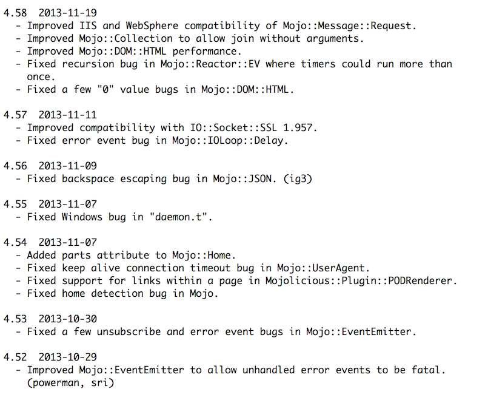

# Mojoliciousの<br />知りたい10のコト

### Yusuke Wada a.k.a. yusukebe

#### 2013-11-20
#### Shibuya Plack/PSGI Conference (shibuya.pl) #1

___

### はじめに

---

## JPA理事になりました！

---

### YAPC::Asia 2014 やります！

---

ところで

___

### 質問

> Mojolicious使っている人ー？(^o^)／

---

Mojolicious力高い人少なそうなので^^

---

### Mojoliciousの知りたいことコト

___

### No.1

> フルスタックってほんと？

---

### Answer

- 機能が揃っているかという意味では**No**
- 機能を自作しているという意味では**Yes**

---

### コアモジュール以外には非依存

    $ cpanm Mojolicious

---

### そういえば最近...

Mojolicious::Validatorが追加された

    my $validator  = Mojolicious::Validator->new;
    my $validation = $validator->validation();

    $validation->input({ message => 'Hello Mojolicioius' });
    $validation->required('message')->size(1, 140);
    if ($validation->has_error()) {
        ...;
    }

実に簡素！

---

特に統合されてて便利！とかじゃないので使わない...？

> 何ためのバリデータ？

---

### フルスタックといえども<br />他のモジュールは使う...

___

### No.2

> Mojolicious::Liteで簡単につくれるの？

---

### Answer

これは便利。"code"形式のOAuthアプリを試すとか...

    $ mojo generate lite_app app.pl

---

```
get '/' => sub {
  my $self = shift;
  $self->stash->{message} = 'Hello Mojolicious';
  $self->render('index');
};
app->start;
__DATA__

@@ index.html.ep
<html>
  <body>Message: <%= $message %></body>
</html>
```

---

### テンプレ周りがそこそこ便利

---

### テンプレートをファイルに分離

    $ mkdir templates
    $ emacs templates/index.html.ep

---

### ヘルパーの機能より

templates/layouts/default.html.ep

をレイアウトファイルとして使う

    % layout 'default'; 

___

### No.3

> plackupとかで立ち上げられる？

---

### Answer

Mojolicious::Liteの場合...

    $ plackup app.pl

自動で識別

---

Mojoliciousアプリの場合...

### use Mojo::Server::PSGI;

---

.psgi ファイルつくってます！

    my $psgi = Mojo::Server::PSGI->new( app => Bokete::Web->new );
    my $app  = $psgi->to_psgi_app;
    builder {
        enable...;
        $app;
    };

___

### No.4

> 付属のサーバは使わないの？

---

### 2個ある

- morbo - 開発用
- hypnotoad - 本番用

---

## けど使ってない！

確か遅かったから...

---

### 改めてベンチマーク

    get '/' => sub {
        my $self = shift;
        my $param = $self->req->param('foo');
        $self->stash->{message} = 'x' x 12 . $param;
        $self->render('index');
    };

    app->start;
    __DATA__

    @@ index.html.ep
    % layout 'default';
    % title 'Welcome';
    Message: <%= $message %>
    ...;

ref. <http://kazeburo.hatenablog.com/entry/2013/04/15/173407>

---

### 開発向けサーバ


    # morbo
    Requests per second:    154.40 [#/sec] (mean)

    # plackup
    Requests per second:    152.97 [#/sec] (mean)

---

### 本番用サーバ

    # hypnotoad 10 workers
    Requests per second:    566.82 [#/sec] (mean)

    # starman 10 workers
    Requests per second:    602.90 [#/sec] (mean)

    # starlet 10 workers
    Requests per second:    731.37 [#/sec] (mean)

---

### hypnotoadもそこそこ？

---

#### そういえばホットデプロイ出来る

立ち上げる

    $ hypnotoad app.pl

リロード

    $ hypnotoad app.pl

停止

    $ hypnotoad -s app.pl

---

### でも...

- app.psgiをつくってplackup/starmanとかで動かしている
- Plack::Middleware::* が使える
- 複数アプリをマウント出来る

___

### No.5

> Mojo::Baseはいかが？

---

### Answer

- 簡素なアクセッサ
- Web層以外をMojo*でつくりたくない

> **Mouse**使ってます^^

---

#### Mojo::Baseを一応紹介

SYNOPSISより

    package Cat;
    use Mojo::Base -base;

    has name => 'Nyan';
    has [qw(birds mice)] => 2;

    package Tiger;
    use Mojo::Base 'Cat';

    has friend  => sub { Cat->new };
    has stripes => 42;

___

### No.6

> CLIなどで便利な機能はあるの？

---

### 使ってない！！

なので...

---

## ojo

#### $ perl -Mojo -E ...

---

    $ perl -Mojo -E 'say x(g("yusuke.be")->body)->at("title")->text'
    # ゆーすけべー日記 v2

---

## おおおーーー

クール？？

___

### No.7

> ルーティングどう？

---

### Answer

すごく柔軟でいいよ！

> **Mojolicious::Routes::Route** を参照

---

#### Mojolicious-based なモジュール内で...

    my $r = $self->routes;
    $r->namespaces([qw/MyApp::Web::Controller/]);

    $r->get('/entry/:entry_id')->to('entry#show');
    $r->post('/entry')->to( controller => 'Entry', action => 'create' );

ルーティングルールを書く

---

### bridge とか便利

    my $auth_route = $r->bridge->to( 'admin#auth' );
    $auth_route->get('/admin/something')->to( 'admin#something' );

一度ユーザ認証をするアクションを挟む例

___

### No.8

> フックは？

---

### Answer

結構使う

- **before_dispatch**
- **after_dispatch**

---

#### PUT DELETEをサポートしているので...

    $self->hook(
        before_dispatch => sub {
            if ( my $request_method = $c->req->param('_method') ) {
                my $methods = [qw/GET POST PUT DELETE/];
                if ( grep { $_ eq uc $request_method } @$methods ) {
                    $c->req->method( $request_method );
                }
            }
        }
    );

擬似的にブラウザサポートさせる例

___

### No.9

> バージョンアップが頻繁らしいけど？

---

### Answer

#### そうなのそして後方互換もバッサリと切り捨てる！

---



---

### 例えば 3.xx -> 4.xx の時

こいつが廃止された

    $self->render_json( $ref );

わーお

    $self->render( json => $ref );

と書かないと動かない＼(^o^)／

---

### Mojoliciousを使う場合は

### 最新情報をゆるく追いましょう

___

### No.10

> セッションがしょぼいって聞いたけど

---

### Answer

Key/Value+秘密の文字列をBase64エンコードして

Cookieにぶっこんでる

---

### それが気持ち悪い人は

- Plack::Middleware::Session
- もしくは
- 自作マネージャ
- を使いましょう！

___

### まとめ

> ぶっちゃけどうなの？

---

### Answer

- 依存モジュール無しは気に入っている
- 結局Amon2からコードを拝借しているが...
- 変な挙動をしないのでWeb層に限ってはいい

---

### Plackあんま関係なかったけど

> Mojoliciousは

> PSGI簡単にはけるからいいよね！

---

### 以上

#### Mojoliciousの気になる？話をしました〜

おしまい
